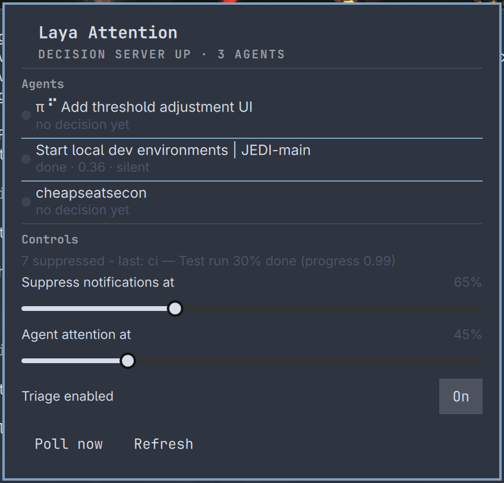

# Omarchy Laya Workspace

<p align="center">
  
</p>

Press `SUPER + CTRL + L`, type what a workspace is for — "Image Editing",
"Q3 release crunch", "Social Media" — and a locally running
[Laya](https://huggingface.co/convaiinnovations/laya) decision server picks
the best-fitting installed apps and launches them into a new Omarchy
workspace. Type the same purpose again and the same workspace comes back,
no classification needed.

The sibling of [omarchy-laya-attention](https://github.com/nblanchard-intact/omarchy-laya-attention):
that plugin decides **which notifications deserve you**; this one decides
**which apps deserve the workspace**. Both run entirely on your machine.

## Requirements

- Omarchy
- A **Laya decision server** on `localhost:8000`:

  ```bash
  uv venv ~/.local/share/laya
  uv pip install --python ~/.local/share/laya/.venv/bin/python "laya[serve]"
  ~/.local/share/laya/.venv/bin/laya-serve   # or run as a systemd user service
  ```

  First run downloads ~850 MB (English checkpoint) or ~1.5 GB with the
  multilingual router default.

## Install

```bash
omarchy plugin add https://github.com/nblanchard-intact/omarchy-laya-workspace.git --enable
```

Or by hand: clone this repo to
`~/.config/omarchy/plugins/cheapseatsecon.laya-workspace/`, then:

```bash
omarchy-shell shell rescanPlugins
omarchy plugin enable cheapseatsecon.laya-workspace
```

## How it works

1. `SUPER + CTRL + L` opens the purpose box (registered at runtime — no
   `bindings.lua` edits)
2. You type a purpose and press Enter
3. One laya call classifies the purpose into a category (coding, image
   editing, communication, gaming, …)
4. Apps for that category come from a curated bucket map
   (`lib/app-categories.json`) — deterministic, no model noise — plus at
   most one "discovery" pick from a second laya call over the rest of your
   installed apps
5. A window rule + `gtk-launch` place the apps into a special workspace
   named after the purpose (`special:laya-image-editing`); the workspace
   auto-creates as the windows map

Purposes are remembered in
`~/.local/state/laya-workspace/purposes.json` and listed in the panel —
click one to relaunch the same set without any classification.

## Why special workspaces

Special workspaces keep apps alive when toggled and are the one workspace
type window rules can auto-create on this Hyprland version (verified on
0.56.2). The apps stay running; the keybinding to toggle the workspace
visibility is `SUPER + U`-style special-workspace toggle — assign one in
`bindings.lua` if you want a key for it, or use the Omarchy workspaces
widget.

## Configuration

Inline on the plugin's entry in `~/.config/omarchy/shell.json`:

```json
{
  "id": "cheapseatsecon.laya-workspace",
  "maxApps": 3,
  "appThreshold": 0.5,
  "workspacePrefix": "laya"
}
```

| Key | Default | Meaning |
|---|---|---|
| `maxApps` | `3` | Maximum apps launched per purpose |
| `appThreshold` | `0.5` | Minimum discovery score for a non-curated app |
| `workspacePrefix` | `laya` | Prefix for the special workspace slug |

## Privacy

The purpose text goes to `localhost:8000` and nowhere else. The category
taxonomy, app buckets, and launch decisions all stay on this machine.

## Remove

```bash
omarchy plugin remove cheapseatsecon.laya-workspace
```

State (`~/.local/state/laya-workspace/`) and the laya venv are left in
place; remove them by hand for a full cleanup.

## License

MIT

## Scan, classifications, and the learned map

**Scan and classify apps** (in the panel) runs a full pass over your
installed apps: shipped curated entries and the desktop `Categories=`
bridge resolve deterministically; anything unknown is classified through
laya and persisted to the learned map
(`~/.local/state/laya-workspace/app-buckets.json`) at ≥ 0.6 confidence —
ambiguous apps are skipped and retried on the next scan instead of being
pinned wrongly.

**Edit classifications** opens the learned map in your default editor —
fix a wrong entry by hand, save, and the next scan uses it. Deleting an
app prunes its entry automatically on the next scan.

The shipped map covers the standard Omarchy app set out of the box, so a
fresh install needs no scan at all.
